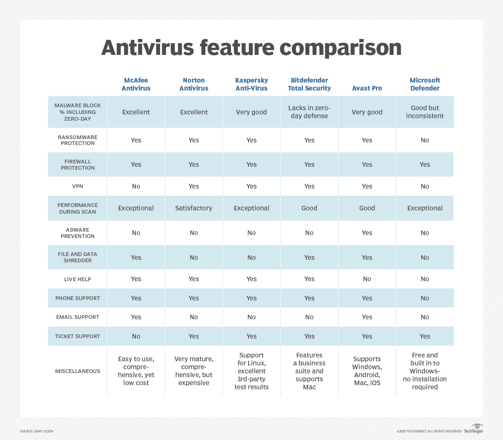
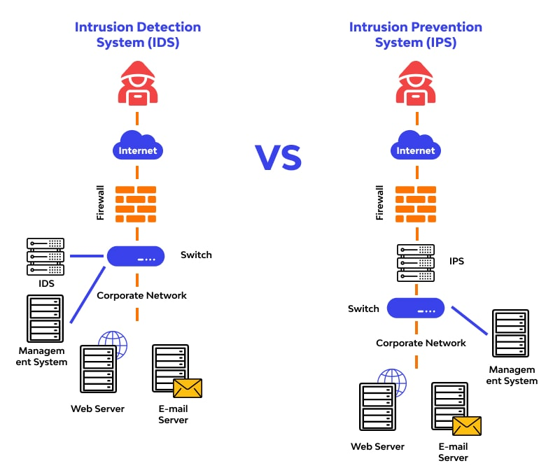

# Network Security Applications and Tools

Network security applications and tools play a crucial role in ensuring security in modern information technologies. Here are some fundamental applications and tools in this field:

1. Firewalls
2. Antivirus Software
3. Virtual Private Networks (VPNs)
4. Intrusion Detection System (IDS) and Intrusion Prevention System (IPS)
5. Endpoint Detection and Response (EDRs)
6. Security Information and Event Management (SIEM) Tools
7. Vulnerability Scanners
8. Packet Sniffers
9. DoS/DDoS Protection Tools

These tools and applications serve as cornerstones for enhancing network security and providing protection against attacks. Their utilization can vary based on the complexity, size of the network infrastructure, and industry-specific needs. When used in an appropriate combination with regular updates, they can form an effective strategy for ensuring network security.

## Importance of Basic Security Practices: Firewalls, Antiviruses, and IDS/IPS

### Brief Overview of Firewall Types and Their Importance

Firewalls are a crucial part of computer network security, controlling traffic within or outside a private network. They analyze incoming packets based on predetermined rules, determining permitted or denied traffic. Acting as gateways or gatekeepers managing permissible and restricted web activity within a private network, firewalls create choke points for web traffic. These points undergo scrutiny based on a series of programmed parameters to govern subsequent actions. Some firewalls also monitor traffic and connections in audit logs for reference regarding permissions or denials. Primarily, firewalls are used to fortify the borders of a private network or its core devices, falling under the umbrella of access control for heightened security.

Types of firewalls:

1. **Packet Filtering Firewalls:** They filter incoming packets based on attributes like source and destination addresses, port numbers, and protocol types. Filtering is not content-based but relies on packet characteristics, making this method the simplest and most economical for filtering network traffic.

2. **Stateful Inspection Firewalls:** These systems not only filter packets but also monitor the state of network traffic. This includes information about whether a connection is open or closed, its direction, duration, and more. This data enables more effective filtering of network traffic.

3. **Application Layer Firewalls:** These filters operate at the application layer and scrutinize traffic based on packet content. Consequently, they're the most effective method for filtering network traffic. However, they require more resources and are typically more expensive.

4. **Circuit-Level Gateways:** Filtering at the circuit level, these firewalls operate based on packet content rather than the source or destination. They are the simplest and most economical method for filtering traffic but are less effective.

**Why are Firewalls Necessary ?** 

Firewalls bolster security by controlling incoming and outgoing network traffic. Their primary task involves regulating data traffic between devices accessing a computer network, thwarting unwanted traffic. Hence, firewalls are pivotal in safeguarding computer systems and networks. Several reasons underscore the necessity of firewalls:

- **Prevention of Malicious Software:** Firewalls prevent harmful software from infiltrating systems, averting damage caused by viruses, worms, and trojans.
- **Ensuring Network Security:** They protect networks by intercepting requests from unsafe sources, shielding against hackers, spyware, and cyber attacks.
- **Preventing Data Leakage:** By thwarting external infiltration, firewalls secure stored data, safeguarding against data breaches.
- **Legal Compliance:** For certain sectors (e.g., healthcare, finance, law), adherence to specific security standards is mandatory. Firewalls ensure compliance with these standards.
- **Enhancing Network Performance:** By blocking harmful traffic, firewalls optimize network performance, facilitating faster operations.
- **Simplified System Management:** Firewalls streamline tasks like monitoring, reporting, and managing network traffic for administrators, enabling more efficient security measures.

**Factors to Consider When Choosing a Firewall**

1. **Identifying Requirements:** Clear identification of the threats you need protection against (e.g., viruses, malware, spam, trojans) is crucial.
2. **Performance:** The firewall's performance should match the size and traffic of your network.
3. **Ease of Use:** User-friendly interfaces facilitate effective firewall utilization and management.
4. **Features:** Look for desired features like application layer filtering, VPN support, antivirus, IDS/IPS.
5. **Reliability:** Consider the credibility of the manufacturer, their support, and update services.

Firewall Software tools  Examples:

Various brands offer different firewall features and solutions. Assessing their suitability based on your network's needs is vital:

* **Fortinet:** Known for its extensive product range, it stands out with strong performance and features like IPS/IDS, VPN, and antivirus.

* **Cisco:** Offers high-performance security firewalls and a wide array of network security products. Products like Cisco ASA and Firepower are known for robust network management and security features.

* **Check Point:** Provides advanced firewall solutions, emphasizing application-based security, high performance, and suitability for large-scale networks.

* **Palo Alto Networks:** Stands out with next-generation security firewalls. It draws attention with its ability to monitor and manage network traffic at the application level.

* **SonicWall:** Offers a wide range of products for both small and medium-sized businesses. It provides robust security features, VPN support, and scalability.

* **Juniper Networks:** Provides high-performance firewall solutions. The SRX Series is typically preferred for large networks.

* **Barracuda Networks:** Offers both physical and cloud-based firewall solutions. It features user-friendly interfaces and extensive security features.

* **Sophos:** Draws attention with a user-friendly interface and various security features. It offers a firewall along with antivirus and spam filtering capabilities.

* **WatchGuard:** Generally preferred for providing protected network security, especially for small and medium-sized businesses. It also offers VPN and other security features.

* **McAfee, Norton, Kaspersky, Avast, Bitdefender:** These brands typically offer consumer-focused security products for individual users. However, some may also provide enterprise-level firewall solutions.

Each brand emphasizes specific advantages and features, necessitating a thorough evaluation to select the most suitable solution for your network requirements.

### Overview of Antivirus Software

Antivirus software is a type of computer program developed in the late 1990s to detect and eliminate malicious software that infects computers. Initially, they were used primarily to detect and remove basic but harmful viruses like trojans. However, as technology advanced, they evolved to combat more complex and varied forms of malicious software and attack methods, becoming more intricate in their operations. Modern antivirus programs aim not only to detect viruses but also to identify and eliminate various potential threats.

They can detect various types of malicious software, including ransomware, spyware, trojans, worms, malware that engages in cryptocurrency mining, malicious software that can turn your computer into a zombie machine, and identity theft-related malware. These different forms of malware often cause significant problems, especially in the corporate sector. Today's antivirus programs strive to identify and eliminate such threats.

**How do they work?**
Antivirus programs typically possess extensive databases of known malicious software signatures. These databases are regularly updated as new vulnerabilities or software are discovered to ensure customers are protected against current threats. When antivirus programs encounter a malicious software on a system they're scanning, they compare its digital signature, known as a 'hash,' with examples in their signature-based database. If a match is found, indicating a known malicious software, the antivirus software removes it from the computer. However, detecting new viruses that aren't in signature databases remains an area of ongoing development. Antivirus programs today also use various features to detect anomalies within systems or file directories, alerting users and halting ongoing processes that might indicate potential threats.

 **Antivirus Software Tools**
Some of the popular antivirus software used in Turkey and around the world include:

* **ESET:** Known for reliability and effective virus detection while using low system resources.
* **Kaspersky:** Renowned for a wide range of features, strong virus detection, and protection against online threats.
* **Bitdefender:** Recognized for effective virus protection, minimal performance impact, and a user-friendly interface.
* **Norton:** Strong history in protecting online privacy, detecting malicious software, and preventing zero-day attacks.
* **Avast:** Widely used for its free version, real-time protection, user-friendly interface, and additional tools.
* **McAfee:** Known for its comprehensive feature set, protection against online threats, and user-friendly interface.
* **F-Secure:** Trusted for online privacy protection, malware detection, and ease of use.
* **AVG:**  Known for its free version and offering a broad range of protection with a user-friendly interface and real-time protection.

Here's the comparison of these antivirus software in a table format:

### What are the differences between a firewall and antivirus software?
Firewalls and antivirus software are two different security tools used to protect computers from malicious software. While antivirus software detects and removes malicious software present on a computer, firewalls control a computer's network traffic and block malicious network traffic. Antivirus software identifies malicious software in programs and files running on your computer, whereas firewalls identify malicious software in your computer's network connections. Antivirus software focuses on threats inside your computer, while firewalls focus on threats outside your computer.

### The Significance and Functions of VPNs: Secure Connections and Data Protection

A Virtual Private Network (VPN) is a way to establish a secure connection within organizations and safeguard data transmission over the internet. VPNs generally encompass the following elements:

*Encryption:* VPNs encrypt transmitted data, protecting it from external threats. This ensures that data remains safeguarded from unauthorized access. Information is encrypted as it travels from one point to another and can only be deciphered by the recipient possessing the correct key.

*Tunneling:* VPNs create a secure communication pathway known as a "tunnel." This enables data packets to be securely sent and received. The tunnel establishes the infrastructure necessary for securely transmitting data.

*Remote Access:* VPNs allow remote or geographically dispersed users to securely access the company network. This ensures data security while navigating through security firewalls and other protective measures.

*Authentication and Authorization:* VPNs are typically equipped with authentication methods. Various security protocols are used to authenticate users' identities and allow access only to authorized individuals.

VPNs can be used within corporate networks, for secure remote access by employees, or to protect sensitive data. They're also utilized to establish secure connections on public networks, like public Wi-Fi.

Internet users can use VPN tools to encrypt internet traffic and maintain their privacy. VPNs hide users' IP addresses, preventing tracking attempts from internet service providers (ISPs) and other third parties. Additionally, VPN tools enable users to bypass geographical restrictions and access blocked websites.

According to a review by **SafetyDetectives** in 2023, the top 10 VPN services were listed ¹. In this review, **ExpressVPN** was identified as the best VPN service due to its excellent security, ultra-high speeds, and outstanding user experience. **ExpressVPN** has a strict no-logs policy, is packed with features for both streamers and torrenters, and protects all purchases with a 30-day money-back guarantee.

Additionally, other VPN services such as **PIA VPN**, **ProtonVPN**, **NordVPN**, and **Surfshark** were also recommended in **SafetyDetectives**' review.

Regarding free VPN tools, examples include **ProtonVPN**, **Windscribe**, **Hotspot Shield**, **TunnelBear**, **Opera VPN**, **Betternet**, and **Speedify**.

Overall, VPNs are used to ensure data security, protect privacy, and guard against unauthorized access, especially in situations involving the transfer of sensitive information.

### IPS and IDS: Safeguarding Networks in the Digital Era

#### IPS (Intrusion Prevention System) 

IPS is a cybersecurity tool that monitors network traffic and blocks suspicious or malicious traffic. It detects anomalies by comparing network packets with a database of known cyber threats using heuristic methods. It comprises four different types:

1. **Network-based IPS (NIPS):** Analyzes network traffic and applies filtering and blocking rules to points in the network to prevent suspicious or harmful traffic. Usually found at gateways or key points in the network.
2. **Host-based IPS (HIPS):** Found as software running on host computers, assisting in monitoring and protecting a computer's own system. For instance, antivirus software may have HIPS features.
3. **Wireless IPS (WIPS):** Used in wireless networks, it monitors wireless access points and detects and prevents suspicious or harmful traffic.
4. **Distributed IPS:** Created by IPS devices located in different parts of a network, communicating with each other to provide broader protection, often used in large-scale networks.

The significance lies in providing a definitive level of security required for secure and reliable data exchange. Serving as a customizable defense innovation for framework security after conventional innovations, an intrusion prevention system offers the ability to avoid attacks through an automated method that doesn't require IT collaboration, enabling cheaper costs and greater performance flexibility. As digital attacks become increasingly complex, defense solutions must evolve with their threats.

#### IDS (Intrusion Detection System)

IDS is a cybersecurity tool that monitors network traffic, identifies suspicious activities, and logs them. It compares network packets with a database containing known cyberattack signatures and uses correlation methods. There are different types:

1. **Network-based IDS (NIDS):** Monitors network traffic, identifying suspicious activities. Typically found at gateways or key points in the network.
2. **Host-based IDS (HIDS):** Found as software on a host computer, monitoring the activities of that computer, aiding in securing a specific computer.
3. **Protocol-based IDS:** Focuses on detecting unexpected behaviors or misuse of specific communication protocols.
4. **Virtual Machine-based IDS:** Monitors activities of virtual machines and detects threats in virtualized environments.

IDS assists in preventing attacks and contributes to the development of defense strategies. Considered a fundamental element of information security, these systems hold critical importance in modern digital environments.

#### IPS vs. IDS

IPS not only monitors but also controls and blocks traffic, altering or preventing packets. In contrast, IDS only scans packets and flags them as dangerous. While IPS focuses on preventing attacks, IDS detects and reports threats without taking direct preventive actions.

### Endpoint Detection and Response (EDR)

Endpoint Detection and Response (EDR) is a cybersecurity technology used to mitigate malicious cyber threats by continuously monitoring endpoints such as mobile phones, laptops, and Internet of Things devices. EDR records activities and events on endpoints, providing security teams with the necessary visibility to detect anomalies.

These solutions track real-time events on endpoints and offer advanced threat detection, investigation, and response capabilities. These include features like event searching, alert triage, verifying suspicious activities, identifying and mitigating threats.

**Why is endpoint security important?**

Endpoint security is a crucial aspect of cybersecurity that helps protect networks from cyber threats while employees work remotely. With the rise of remote work, more people are accessing their company's network from various locations, making it easier for cybercriminals to exploit endpoints and gain unauthorized access to sensitive data. Endpoint Detection and Response (EDR) tools are used to continuously monitor endpoints and detect malicious activity in real-time. EDR solutions provide security teams with the visibility they need to uncover incidents that would otherwise remain invisible. 

Endpoint security is important because it helps companies defend themselves against the growing risks of possible cyber-attacks on network data and other information. It is also important to note that human error is a significant factor in cyber-attacks, and endpoint security can help mitigate this risk . 

Some commonly used EDR tools include:

- **CrowdStrike Falcon:** Known for behavioral analysis and rapid response capabilities.
- **Carbon Black (VMware Carbon Black):** Offers threat detection and response capabilities.
- **FireEye Endpoint Security:** Provides advanced threat detection and response features.
- **SentinelOne:** Utilizes machine learning and artificial intelligence for protection.
- **Trend Micro Apex One:** Known for cloud-based security features.
- **Symantec Endpoint Security (Broadcom Endpoint Security):** Offers threat detection and automatic response capabilities.
- **Microsoft Defender for Endpoint:** Provides cloud-based threat intelligence and robust detection features.

While these solutions vary in their features and levels, they play a significant role in detecting and responding to threats on endpoints. Organizations should choose the one that best fits their needs and budget to maximize security on their endpoints.

#### Security Information and Event Management (SIEM)

Security Information and Event Management (SIEM) tools are used to monitor and manage security incidents using data analytics and automation. They can assist in detecting malicious activities in your network by monitoring all incoming and outgoing traffic. SIEM systems help corporate security teams detect user behavioral abnormalities and automate many manual processes associated with threat detection and incident response using artificial intelligence (AI). The original SIEM platforms were log management tools that combined Security Information Management (SIM) and Security Event Management (SEM), allowing real-time monitoring, analysis of security-related events, and the monitoring and recording of security data for compliance or audit purposes. Over the years, SIEM software has evolved to include advanced security analytics, AI, and machine learning capabilities alongside user and entity behavior analytics (UEBA) to detect abnormal behaviors and advanced threat indicators. Today, SIEM has become a fundamental tool in modern Security Operations Centers (SOCs) for security monitoring and compliance management use cases.

Here are some of the leading and most commonly used SIEMs:

1. **Splunk:** Specializes in big data analysis, gathering extensive amounts of data from different sources and analyzing them to identify security threats. It stands out with its flexibility and broad integration capabilities.
2. **LogRhythm:** Offers log management, security analytics, and compliance automation. It is robust in real-time monitoring and threat detection.
3. **IBM QRadar:** Detects abnormal activities by integrating security information from multiple sources. It also includes an artificial intelligence component that enables quick threat assessment.
4. **ArcSight (Micro Focus):** Provides event management and security analytics. It excels in effective monitoring and threat detection in large-scale networks.
5. **AlienVault USM (AT&T Cybersecurity):** Functions as a unified security platform, encompassing features like SIEM, network threat detection, asset discovery, and compliance management.
6. **SolarWinds Security Event Manager:** Possesses real-time threat detection, compliance reporting, and log management capabilities. It stands out for its ease of use.
7. **RSA NetWitness Platform:** Stands out as a tool for analyzing network traffic and deep-dive investigations of events. It includes advanced threat detection and response features.
8. **Securonix:** Effective in threat detection and response with advanced analytics and AI capabilities. It is strong in user and entity behavior analytics (UEBA).

These tools offer different strengths and capabilities. While some focus on big data analysis, others excel in real-time threat detection and response capabilities. When making a choice, organizations should consider their needs, budget, and integration requirements. Each tool may vary in different scenarios.

In conclusion, SIEM stands out as a critical tool for organizations to monitor, detect, and respond to security threats in their expansive and complex digital environments. To cope with the continuously evolving threat landscape and ensure data security, SIEM remains indispensable for security professionals."

### Vulnerability Scanners

Vulnerability scanners are essential tools used in cybersecurity to identify weaknesses and potential vulnerabilities within computer systems, networks, or applications. These scanners systematically examine systems for known security issues, misconfigurations, or weaknesses that could potentially be exploited by attackers.

These tools operate in various ways:

1. **Network Scanners:** These assess network devices, such as routers, switches, and servers, for open ports, outdated software, or known vulnerabilities in their configurations. They analyze the network infrastructure to detect potential entry points for attackers.

2. **Web Application Scanners:** These focus on web applications, identifying common security flaws like SQL injection, cross-site scripting (XSS), or insecure authentication mechanisms. They crawl through the web application, attempting to identify vulnerabilities that could compromise data or functionality.

3. **Host Scanners:** These target individual systems or hosts, checking for outdated software versions, missing security patches, or misconfigurations in operating systems or installed applications.

4. **Database Scanners:** These are specialized tools that specifically scan databases for vulnerabilities in their configurations or access control mechanisms.

Some common vulnerability scanning tools:

1. **Nessus:** Nessus is a comprehensive vulnerability scanner known for its extensive database of known vulnerabilities. It conducts thorough scans across networks, systems, and applications, detecting misconfigurations, missing patches, and potential security issues. Nessus provides detailed reports with prioritized remediation steps, aiding in risk mitigation.

2. **OpenVAS (Open Vulnerability Assessment System):** OpenVAS is an open-source vulnerability scanner designed for assessing networks for potential vulnerabilities. It offers a suite of tools to perform comprehensive scans, identifying weaknesses in networks, hosts, and services. OpenVAS provides both vulnerability assessment and management capabilities.

3. **Qualys:** Qualys is a cloud-based vulnerability management platform offering a range of tools for continuous security monitoring. It performs automated scans across networks, web applications, and databases, delivering real-time insights into potential risks. Qualys provides comprehensive reports and prioritizes vulnerabilities based on severity.

4. **Acunetix:** Acunetix specializes in web application security scanning, focusing on identifying vulnerabilities like SQL injection, XSS, and other common web-based threats. It crawls through web applications, examining both front-end and back-end vulnerabilities. Acunetix offers detailed reports and helps developers patch vulnerabilities efficiently.

These tools share the common goal of identifying weaknesses and vulnerabilities within systems, networks, or applications. They provide detailed reports, often with recommendations on how to remediate or mitigate these vulnerabilities. Regular use of these scanners is essential for maintaining a strong security posture and safeguarding against potential cyber threats.

### Packet Sniffers 

Packet capture is a process that involves monitoring and analyzing transmitted data packets within a network. This procedure is carried out using software tools designed to observe and analyze data transmission in a network. Packet capture tools allow for a detailed examination of network traffic, aiding in understanding the flow of communication. This capability is crucial for evaluating network performance, identifying issues, and pinpointing security vulnerabilities.

In the realm of network security, packet capture plays a pivotal role. Security experts can detect potential threats and identify weaknesses within a network by monitoring network traffic. For instance, the presence of unencrypted communication, unauthorized access attempts, or the existence of malicious software can be identified through this method. This information enables the implementation of measures to enhance network security.

* **Wireshark** : Stands as a popular packet capture tool utilized for monitoring, analyzing, and conducting detailed examinations of network traffic. It supports various network protocols and can capture packets associated with these protocols. Its graphical interface allows users to monitor network traffic in real-time and thoroughly analyze it.
* **Tcpdump** : Is a powerful command-line tool used in Unix-like operating systems for monitoring, capturing, and analyzing network traffic. Its flexibility and diverse filtering options allow for comprehensive scrutiny of network data. 
* **Tshark**  : The command-line version of Wireshark, offers similar analytical capabilities without the necessity of a graphical interface, making it suitable for deployment in remote or server-based systems. 
* **Ettercap** : Serves the purpose of executing network attacks and pinpointing security vulnerabilities, capable of performing man-in-the-middle attacks, detecting protocol weaknesses, and manipulating network traffic. 
* **Snort** : Operates as an Intrusion Detection System (IDS), surveilling network traffic and identifying potential threats based on specific signature-based rules, empowering networks to recognize and counter potential attacks.

These types of tools significantly contribute to network security by aiding in the identification of potential security vulnerabilities within network traffic. This information empowers network administrators and security professionals to take necessary measures to bolster the security of their networks.

### DoS/DDoS 

DoS (Denial of Service) and DDoS (Distributed Denial of Service) attacks are attempts to disrupt or stop the normal functioning of a network or service. DoS attacks aim to render a service unusable by sending intense traffic from a single source towards a specific target, while DDoS attacks are more effective as they involve multiple sources simultaneously flooding the target with high traffic. DoS/DDoS protection tools are used to safeguard networks and systems against these kinds of attacks.

**Key features of DoS/DDoS protection tools**

1. **Traffic Filtering and Routing:** These tools analyze incoming network traffic and can differentiate between normal and attack traffic to filter out the attack traffic or isolate it. They can also route traffic through different pathways to stop the attack before it reaches the target.

2. **Attack Detection and Monitoring:** DoS/DDoS protection tools monitor network traffic to detect anomalies. By analyzing behavioral patterns and changes in traffic, they can identify attacks and allow for quick intervention.

3. **Load Balancing:** Attack traffic often overwhelms targeted servers. Load balancing distributes traffic evenly across different servers or network resources to ensure uninterrupted service.

4. **Immediate Response and Temporary Blocking:** These tools can automatically block attack sources temporarily once an attack is detected, minimizing its impact and providing swift response mechanisms.

5. **Bandwidth Limitation and Attack Mitigation:** They control bandwidth to absorb and mitigate the effects of attack traffic. Additionally, they employ attack mitigation techniques to neutralize attack traffic.

6. **System Updates and Scalability:** DoS/DDoS protection tools are regularly updated to provide protection against new attack types. They also offer the flexibility to integrate with evolving or changing network structures.

DoS/DDoS protection tools are typically used alongside various security devices or software such as network security appliances, firewalls, load balancers, Intrusion Detection and Prevention Systems (IDPS), among others. They enhance the security of networks and systems, making them more resilient against attacks.

### The Importance of Fundamental Security Practices

Network security applications and tools play a critical role in safeguarding networks. When used together, they enhance the overall strength and comprehensiveness of network security. For instance, while firewalls regulate incoming and outgoing traffic, antivirus software focuses on detecting malicious software. These tools, while monitoring network traffic, establish security at every level of the network, creating a layered defense against attacks. Additionally, SIEM tools are employed for monitoring security events and threats, providing a robust platform to bolster network security and identify potential attacks. Altogether, these applications and tools collaborate to form an effective strategy in ensuring network security. This consolidation strengthens defense mechanisms against potential attacks, thereby increasing the resilience of networks.